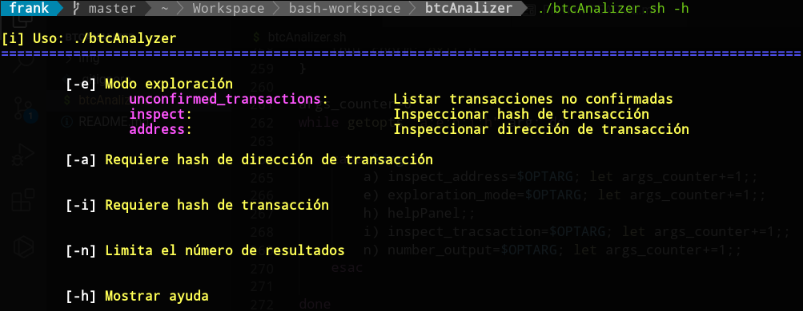
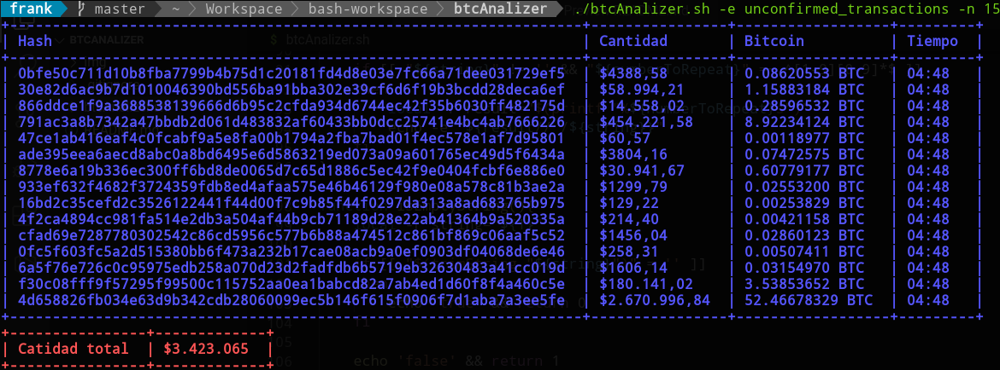
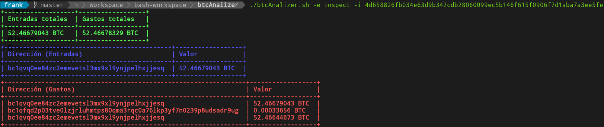
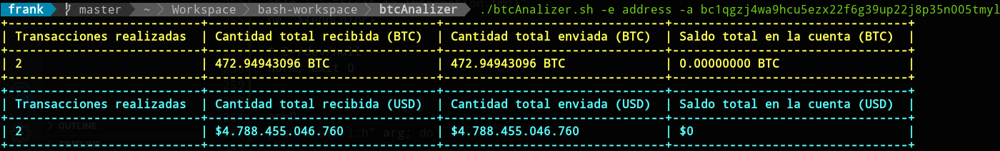

# BTC Analizer

Para utilizar esta herramienta es necesario instalar estas utilidades:

```bash
    apt-get install html2text bc -y
```

## Capturas

### **Ayuda:**
<p align="center">
    
</p>

### **Inspeccionando transacciones no confirmadas:**
<p align="center">
    
</p>

### **Inspeccionando transacción:**
<p align="center">
    
</p>

### **Inspeccionando dirección de transacción:**
<p align="center">
    
</p>